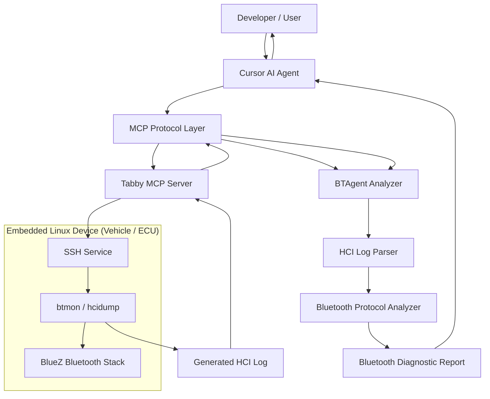
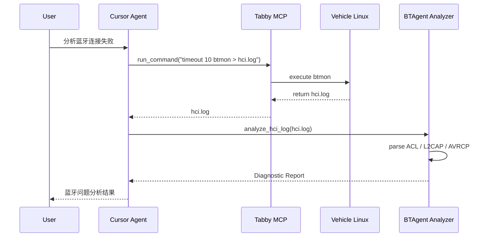

## Architecture



---

## HCI Log Collection Workflow



---

## Parser 分层架构（BTSnoop / HCI 解析）

解析采用分层设计，便于按协议扩展（HCI → L2CAP → SDP / ATT / RFCOMM 等）。

```
BTSnoop 文件
    → parsers/btsnoop.py (BTSnoopParser)
        → 按 record.flags 分发：
            • Host→Controller (CMD)  → parsers/hci/command.py  (HCI 命令)
            • Controller→Host (EVT)  → parsers/hci/event.py    (HCI 事件)
            • ACL 数据               → parsers/hci/acl.py     (ACL 头 + L2CAP 头)
    → ACL 内按 CID 分发：
        → parsers/l2cap/ (parse_l2cap_payload)
            • CID 0x0001 信令  → l2cap/signaling.py
            • CID 0x0004 ATT   → l2cap/att.py
            • 其他 CID/PSM     → 可扩展 SDP、RFCOMM 等
```

**目录与职责：**

| 目录/文件 | 职责 |
|-----------|------|
| `parsers/btsnoop.py` | 读 BTSnoop、拆记录、剥 HCI Indicator、按 flags 调用 HCI 层 |
| `parsers/hci/` | HCI 命令 / 事件 / ACL 解析；ACL 内调用 L2CAP |
| `parsers/l2cap/` | L2CAP 头、信令、ATT；按 CID 分发，可挂接 SDP 等 |
| `parsers/sdp/` | SDP PDU 解析（占位）；可在 L2CAP 层按 PSM/CID 挂接 |

**扩展方式：** 新增协议（如 RFCOMM）时：在 `parsers/` 下建子包（如 `rfcomm/`），在 L2CAP 的 `parse_l2cap_payload` 中按 CID 或 PSM 识别并调用对应解析函数，将结果合并到 `record.parsed`。