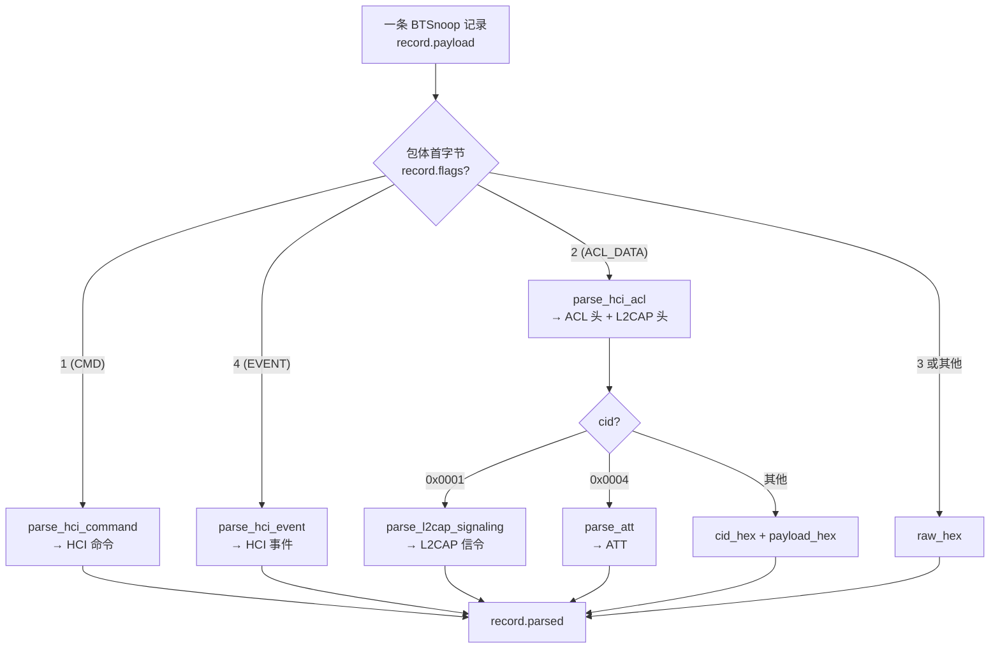
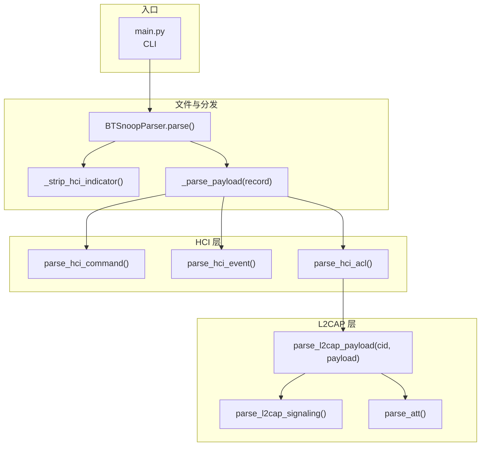
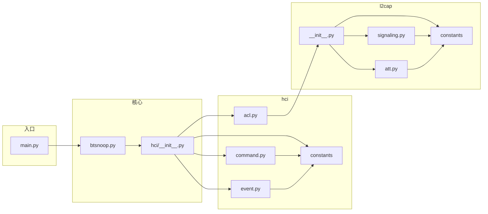

# 日志解析层设计

本章说明 BTSnoop HCI 日志的解析层设计：分层结构、数据流、单条记录的分发决策，以及模块职责与扩展方式。

---

## 1. 设计目标与分层思路

日志解析层负责将**原始 BTSnoop 二进制文件**转为**结构化的每条记录**（`HCIRecord`），每条记录除原始字节外，还包含按协议解析后的结果（`record.parsed`），供上游做统计、诊断或导出报告使用。

设计上采用**自上而下的协议分层**：

- **文件层**：识别 BTSnoop 格式，按记录拆包，得到带时间戳和包体的「裸记录」。
- **HCI 层**：根据包体首字节区分类型（命令 / 事件 / ACL），分别调用命令解析、事件解析、ACL 解析。
- **L2CAP 层**：仅对 ACL 数据生效，解析 L2CAP 头后按 **CID** 分发到信令、ATT 等子解析器。

这样每一层只关心本层协议，下层通过函数调用接入，便于后续按 CID/PSM 挂接 SDP、RFCOMM、A2DP 等而无需改动上层。

---

## 2. 整体数据流

从 BTSnoop 文件到最终 `record.parsed` 的流向如下。

- **BTSnoop 文件**：由 btmon、Elisys 等工具抓取的 HCI 日志，二进制格式，每条记录为「固定头 + 变长包体」。
- **BTSnoopParser**：读文件、校验魔数、按记录解析头与包体，得到 `HCIRecord` 列表；对每条记录根据**包体首字节**判定类型并调用 HCI 层。
- **HCI 层**：命令（CMD）、事件（EVENT）、ACL 数据（ACL_DATA）分别进入 `parse_hci_command`、`parse_hci_event`、`parse_hci_acl`；ACL 解析出 L2CAP 头后进入 L2CAP 层。
- **L2CAP 层**：`parse_l2cap_payload(cid, payload)` 按 CID 分发：0x0001 走信令，0x0004 走 ATT，其它可扩展。
- **record.parsed**：各层解析结果合并到单条记录的 `parsed` 字段，供统计、Markdown/JSON 导出和后续分析使用。

---

## 3. BTSnoop 文件与记录格式

BTSnoop 文件由**全局头**和若干**记录**组成。

- **全局头**（前 16 字节）：魔数 `btsnoop\0`、版本、链路类型等；解析器用其校验格式并填充 `header_info`。
- **每条记录**：**24 字节固定头 + 变长包体**，头为大端：

| 偏移   | 长度   | 含义 |
|--------|--------|------|
| 0–3    | 4 字节 | 原始包长度（orig_len） |
| 4–7    | 4 字节 | 本记录包含长度（incl_len） |
| 8–11   | 4 字节 | 记录头 flags（本解析器不用于类型判断） |
| 12–15  | 4 字节 | 保留 |
| 16–23  | 8 字节 | 时间戳（微秒） |
| 24…    | incl_len 字节 | 包体（HCI 报文） |

**HCI 包类型**由**包体第一个字节**决定，与记录头 8–11 字节无关：

- `1` → CMD（Host→Controller 命令）
- `2` → ACL_DATA（ACL 数据）
- `3` → SCO_DATA（SCO 数据）
- `4` → EVENT（Controller→Host 事件）

解析器会先根据首字节得到 `hci_type`，再按需剥掉 HCI Indicator（若存在），得到 `payload` 交给对应 HCI 解析函数。

---

## 4. 单条记录解析决策流程

一条 BTSnoop 记录在「文件层 → HCI 层 → L2CAP 层」中的分发与解析决策如下。

- **flags == 1**：命令包，进入 `parse_hci_command`，解析 OGF/OCF、参数等。
- **flags == 4**：事件包，进入 `parse_hci_event`，解析事件码、参数、状态等。
- **flags == 2**：ACL 数据，进入 `parse_hci_acl`，拆 ACL 头与 L2CAP 头，再根据 **L2CAP CID** 分发：
  - **0x0001**：L2CAP 信令（连接请求/响应等）→ `parse_l2cap_signaling`
  - **0x0004**：ATT → `parse_att`
  - 其它 CID：当前仅输出 `cid_hex` 与 `payload_hex`，可在此挂接 SDP、RFCOMM 等。

---

## 5. 解析器调用链（自上而下）

从 CLI 入口到各层解析函数的调用关系如下。

- **main.py**：解析命令行、创建 `BTSnoopParser`、调用 `parse()`、`export_markdown()` / `export_json()`、`analyze()`。
- **parse()**：读文件、校验头、循环每条记录；对每条记录做 `_strip_hci_indicator`，再 `_parse_payload(record)`。
- **_parse_payload**：根据 `record.flags`（即包体首字节）调用 `parse_hci_command`、`parse_hci_event` 或 `parse_hci_acl`，结果写回 `record.parsed`。
- **parse_hci_acl**：解析 ACL 与 L2CAP 头后，将 L2CAP 载荷与 CID 交给 `parse_l2cap_payload`；L2CAP 层内部再按 CID 调用信令或 ATT 解析。

---

## 6. 模块与依赖

解析层主要模块及依赖关系如下。

| 模块 | 职责 |
|------|------|
| **parsers/btsnoop.py** | 读 BTSnoop、拆记录、剥 HCI Indicator、按包体首字节调用 HCI 层，并负责导出与统计 |
| **parsers/hci/** | 提供 HCI_TYPES、HCI_INDICATORS 等常量，以及 command / event / ACL 解析；ACL 内调用 L2CAP |
| **parsers/l2cap/** | 按 CID 分发 L2CAP 载荷，实现信令与 ATT 解析，可在此挂接更多 CID/PSM |

---

## 7. 数据结构：HCIRecord

单条解析结果由 `HCIRecord` 表示，字段包括：

- **seq**：记录序号  
- **timestamp_abs / timestamp_abs_sec / timestamp_rel**：绝对时间（微秒/秒）与相对时间（毫秒，相对首包）  
- **flags**：包体首字节，即 HCI 类型（1/2/3/4）  
- **packet_type / direction**：类型名称与方向（Host→Controller / Controller→Host）  
- **length / data / payload**：原始长度、整包字节、剥掉可选 Indicator 后的载荷  
- **parsed**：各层解析结果合并后的字典（命令名、事件名、ACL 句柄、L2CAP/ATT 等）

导出 Markdown 或 JSON 时，以 `records` 和 `parsed` 为主要内容；统计（命令数、事件数、ACL 数、错误与连接建立/断开）均基于 `records` 与 `parsed` 计算。

---

## 8. 扩展方式

- **新增 HCI 以上逻辑**：在 `_parse_payload` 中增加对新的 `flags` 或子类型的分支，或对现有 CMD/EVENT 做更细的命名/分类。
- **新增 L2CAP 之上协议**：在 `parse_l2cap_payload`（或等价入口）中按 **CID 或 PSM** 识别新协议，调用对应解析函数，将结果合并进同一 `record.parsed`。例如：SDP（PSM 0x0001）、RFCOMM（0x0003）、A2DP、AVRCP 等均可在此挂接。

保持「文件 → HCI → L2CAP → 按 CID/PSM 分发」的单一数据流，便于维护和与 Elisys、Wireshark 等工具对照。
